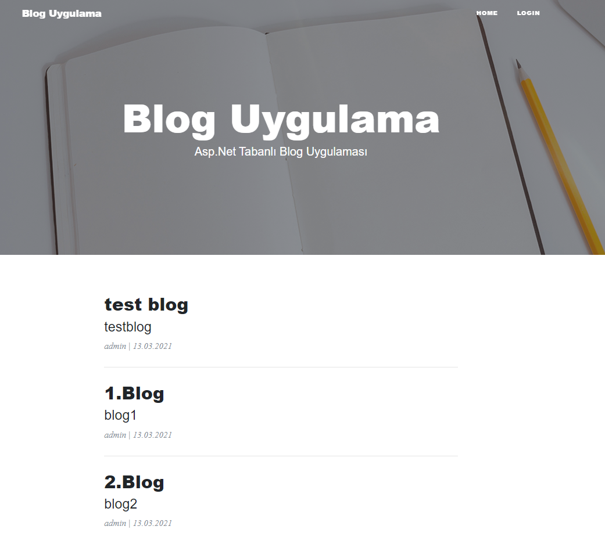

Asp.Net Web Form jQuery, Ajax Based Blog Application

```
    1. Download, Extract Zip
```
```
    2. Right click on the App_Data folder.
    Add a database file.
```

<br />

```
    3. Double click on the blog-db.mdf file.
    The server explorer tab opens. (If it doesn't open, click View from the Visual Studio tabs. 
    Select Server Explorer from here.) 
```

```
    4. Right-click the blog-db.mdf file from the server explorer tab and select New Query. 
```
```
    5. Open the blog-db.sql file in the "db_script" folder.
    Copy the contents of this file and paste it where you opened the "new query". And execute (Ctrl + Shift + E). 
```
<details>
<summary>&nbsp;&nbsp;&nbsp;&nbsp;&nbsp;&nbsp;Open the blog-db.sql file in the db_script folder. </summary>
  
```
Create Table "Users"(
    "UserId" nvarchar(200) NOT NULL PRIMARY KEY,
    "FullName" nvarchar(80) NULL,
    "Email" nvarchar(80) NULL,
    "Username" nvarchar(80) NULL,
    "Image" nvarchar(200) NULL,
    "Gender" nvarchar(10) NULL,
    "Password" nvarchar(MAX) NULL,
    "RoleName" nvarchar(30) NULL
)
Create Table "Categories"(
    "CategoryId" int IDENTITY(1, 1) NOT NULL PRIMARY KEY,
    "CategoryName" nvarchar(100) NULL
)
Create Table "Blogs"(
    "BlogId" nvarchar(200) NOT NULL PRIMARY KEY,
    "BlogName" nvarchar(100) NULL,
    "BlogURL" nvarchar(100) NULL,
    "BlogContent" TEXT NULL,
    "HeaderImage" nvarchar(200) NULL,
    "CreationDate" nvarchar(40) NULL,
    "BlogCategoryId" int NULL FOREIGN KEY REFERENCES Categories(CategoryId),
    "BlogUserId" nvarchar(200) NULL FOREIGN KEY REFERENCES Users(UserId)
)
Create Table "Comments"(
    "CommentId" int IDENTITY(1, 1) NOT NULL PRIMARY KEY,
    "CommentText" nvarchar(200) NULL,
    "Commenter" nvarchar(100)NULL,
    "IsApproved" bit NULL,
    "BlogId" nvarchar(200) NULL FOREIGN KEY REFERENCES Blogs(BlogId)
)
-- Procedures

-- Get Categories Store Procedure
go
CREATE PROCEDURE SP_Get_Categories
AS
BEGIN
SELECT * FROM Categories
END

-- Add New Category Store Procedure
go
CREATE PROCEDURE SP_Add_Category
@CategoryName nvarchar(100)
AS
BEGIN
INSERT INTO Categories(CategoryName) VALUES(@CategoryName)
END

-- Edit Category Store Procedure
go
CREATE PROCEDURE SP_Edit_Category
@CategoryId int
AS
BEGIN
SELECT * FROM Categories WHERE CategoryId=@CategoryId
END

-- Update Category Store Procedure
go
CREATE PROCEDURE SP_Update_Category
@CategoryId int,
@CategoryName nvarchar(100)
AS
BEGIN
UPDATE Categories SET CategoryName=@CategoryName WHERE CategoryId=@CategoryId
END

-- Delete Category Store Procedure
go
CREATE PROCEDURE SP_Delete_Category
@CategoryId int
AS
BEGIN
DELETE FROM Categories WHERE CategoryId=@CategoryId
END
```
</details>

<br>

```
    6. Set a start page. For example;
    
    Right click on the Blog/Index.aspx
    and 
    Click Set As Start Page.
```

```
    7. Run the project.
    Note: During the first run, the packages used in the project will be loaded.
```

```
    That's it. 😀
```
### *[Youtube Video Here](http://www.youtube.com/watch?v=wcaa0A4ePy4)*

[](http://www.youtube.com/watch?v=wcaa0A4ePy4)


## Project Images

### *Admin Interface*
<hr/>


### *User Interface*
<hr/>
